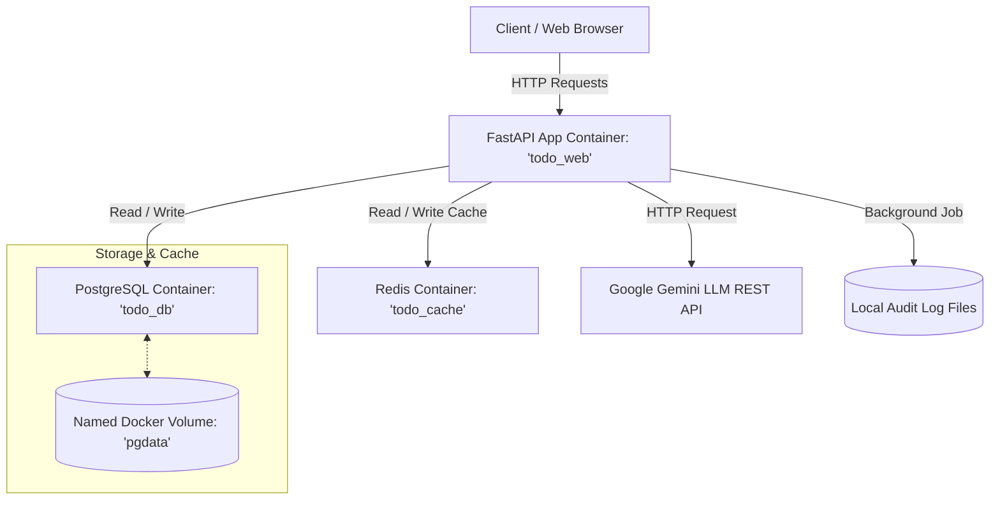

# TaskFlow AI — AI-Powered Task Management Capstone Backend

TaskFlow AI is an advanced, production-ready Task Management Backend API built with **FastAPI**, **PostgreSQL**, and **Redis**, featuring JWT authentication, automated ReportLab PDF task report generation, background task audit logging, and automated Google Gemini LLM task analysis.

This project represents the final **AI Backend Engineering Capstone**, having evolved incrementally from a basic in-memory list API, to a local SQLite database setup, to a containerized PostgreSQL storage layer, and finally to this full-fledged backend stack.

---

## Capstone Concepts Implemented

The TaskFlow AI capstone backend demonstrates the following core backend engineering concepts:

1. **API Endpoints**: Full CRUD cycle endpoints and utility status endpoints utilizing REST conventions and Pydantic validators.
2. **Database Persistence**: Relational schema mapping users and tasks stored in **PostgreSQL**, running in a dedicated Docker container with persistent volumes.
3. **Authentication**: Secure **JWT (JSON Web Tokens)** authentication and bcrypt password hashing ensuring full user resource isolation.
4. **Background Processing**: Non-blocking asynchronous logging of task changes and usage audits using FastAPI `BackgroundTasks`.
5. **PDF Reporting**: On-the-fly binary rendering of styled summary reports using **ReportLab**, returned directly as file attachment streams.
6. **Redis Caching**: User-specific task list caching on `GET /tasks` with dynamic cache misses and write-through cache invalidation.
7. **LLM Integration**: Priority analysis, productivity summaries, and token cost tracking via Google's **Gemini 1.5 Flash REST API**.

---

## Project Architecture



---

## API Endpoints

### 1. Authentication (`/auth`)
- `POST /auth/register` - Register a new user (expects email and password).
- `POST /auth/login` - Authenticate and retrieve a JWT access token (OAuth2 password format compatible with Swagger lock).

### 2. Task Management (`/tasks` - Protected)
- `GET /tasks` - Retrieve the current user's tasks (fully cached).
- `GET /tasks/{id}` - Retrieve a single task by its ID (requires ownership).
- `POST /tasks` - Create a new task (invalidates cache, triggers background logging).
- `PUT /tasks/{id}` - Update task title and done status (invalidates cache, triggers background logging).
- `DELETE /tasks/{id}` - Remove a task (invalidates cache, triggers background logging).

### 3. AI Integration (`/tasks/analyze` - Protected)
- `POST /tasks/analyze` - Analyzes tasks using LLM, returns productivity summaries and priority suggestions, and logs token costs.

### 4. PDF Reporting (`/reports` - Protected)
- `GET /reports/tasks/pdf` - Generates and downloads a custom-styled PDF report containing the user's tasks and stats.

### 5. Utility Route (Public)
- `GET /health` - Returns `{"status": "ok"}` for service health checks.
- `GET /` - Welcome root message response.

---

## Environment Variables

Configuration is loaded from environment variables. The local `.env` file is excluded from Git tracking, but you can create it using the provided template `.env.example`:

| Variable | Default Value | Description |
| :--- | :--- | :--- |
| `DB_USER` | `postgres` | PostgreSQL username |
| `DB_PASSWORD` | `postgres` | PostgreSQL password |
| `DB_NAME` | `todo_db` | PostgreSQL database name |
| `JWT_SECRET` | `(random hex string)`| Secret key used to encrypt JWT access tokens |
| `JWT_ALGORITHM`| `HS256` | Encryption algorithm used for signing tokens |
| `REDIS_HOST` | `cache` | Hostname of the Redis service container |
| `REDIS_PORT` | `6379` | Port of the Redis service container |
| `GEMINI_API_KEY`| `(secret key)` | API key used to make requests to the Google Gemini LLM API |

---

## Getting Started (Docker Compose)

### 1. Configuration Setup
Generate your local environment configuration file:
```bash
cp .env.example .env
```
Open `.env` and fill in your custom details, especially your `GEMINI_API_KEY`.

### 2. Build and Start the Stack
Start all three container services (FastAPI web, PostgreSQL database, and Redis cache) using:
```bash
docker compose up --build -d
```
The database schema will automatically initialize and seed `test@example.com` (password: `password123`) and 3 example tasks when launched for the first time.

### 3. Open API Documentation (Swagger)
Navigate to the interactive Swagger UI:
👉 **[http://127.0.0.1:8000/docs](http://127.0.0.1:8000/docs)**

---

## Core Feature Workflows

### 1. Authentication
1. Go to Swagger UI `/docs` and register a user using `POST /auth/register`.
2. Click the green **Authorize** lock button in the top right of the Swagger UI.
3. Enter your email (in username) and password. Swagger UI will perform a `POST /auth/login` request behind the scenes, acquire the JWT token, and securely sign all subsequent requests.

### 2. PostgreSQL Persistence
- The PostgreSQL database is attached to a named Docker volume (`pgdata`).
- When containers are stopped or removed (`docker compose down`), the data stored in PostgreSQL is not lost. The next time you run `docker compose up`, your users and tasks will still be loaded.

### 3. Redis Caching
- Calling `GET /tasks` queries Redis first. On a cache miss, it fetches tasks from the database, caches them in Redis with a 1-hour expiration time, and returns them.
- Any creation (`POST`), update (`PUT`), or deletion (`DELETE`) of tasks by a user will immediately clear the cache for that user, ensuring no stale data is served.

### 4. LLM Task Analysis
- Submits the authenticated user's current tasks to the Google Gemini REST API.
- Generates JSON containing a short productivity summary and priority suggestions.
- Automatically calculates Gemini Flash input/output token usage costs and writes logs to `logs/ai_usage.log`.
- *Note:* If no valid key is provided, the API automatically falls back to a clean mock response, preventing backend crashes.

### 5. ReportLab PDF Generation
- Navigation to `/reports/tasks/pdf` creates a downloadable attachment.
- Uses **ReportLab** to build a formatted summary page featuring a metadata card (showing user email and timestamp), a tasks status grid, and a custom task details table with color-coded status badges and alternate row striping.

### 6. Background Processing
- Asynchronous logging is queued via FastAPI `BackgroundTasks`.
- Whenever a task is created, updated, or deleted, a background job writes the action, timestamp, task ID, and user ID to the local file `logs/task_statistics.log`. This ensures that auditing does not block the primary HTTP response cycle.
